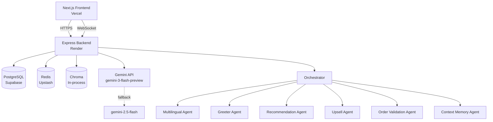

# Smart Dining Assistant — Product Requirements Document

**Version:** 2.0  
**Author:** Ankur Bag  
**Deadline:** 9th June 2026  
**Repo:** Monorepo (`frontend/` + `backend/`)

---

## Table of Contents

1. [Project Overview](#1-project-overview)
2. [Tech Stack](#2-tech-stack)
3. [Monorepo Structure](#3-monorepo-structure)
4. [Environment Variables](#4-environment-variables)
5. [Database Schema (Prisma)](#5-database-schema-prisma)
6. [Backend — Express.js](#6-backend--expressjs)
7. [AI Agent Architecture](#7-ai-agent-architecture)
8. [LLM Fallback Strategy](#8-llm-fallback-strategy)
9. [Frontend — Next.js 14](#9-frontend--nextjs-14)
10. [QR Code Generation](#10-qr-code-generation)
11. [Real-Time (Socket.io)](#11-real-time-socketio)
12. [API Specification](#12-api-specification)
13. [Checkout & OTP Flow](#13-checkout--otp-flow)
14. [Menu Seed Data](#14-menu-seed-data)
15. [Deployment](#15-deployment)
16. [README Requirements](#16-readme-requirements)
17. [Build Order (3-Day Plan)](#17-build-order-3-day-plan)

---

## 1. Project Overview

A full-stack, AI-first smart dining assistant for a restaurant environment. Customers scan a QR code, land on a table-specific page, and interact with an AI agent ("Zara") that recommends dishes, handles group ordering, upsells contextually, and processes checkout — all through natural language including Hinglish.

**No authentication anywhere in the app.** Tables are identified by `tableId` in the URL. Sessions are anonymous and created automatically on first visit.

**Core user journey:**
QR scan → `/table/:tableId` → AI greets by mood → conversation drives the order → group syncs in real time → OTP checkout (mock) → order confirmed.

**What makes it AI-first:**
- AI is the primary interaction layer, not a sidebar widget
- Every recommendation is generated by a dedicated LangChain agent with RAG
- Agents share session memory — preferences respected throughout
- Natural language is the default input; menu grid is the fallback

---

## 2. Tech Stack

| Layer | Choice | Notes |
|---|---|---|
| Frontend | Next.js 14 (App Router) | SSR, file-based routing |
| Styling | TailwindCSS + shadcn/ui | Mobile-first |
| State | Zustand + React Query | Global state + server cache |
| Real-time client | Socket.io client | Cart + group sync |
| Backend | Express.js (Node 20) | Deployed on Render |
| AI Orchestration | LangChain.js (`@langchain/google-genai`) | Multi-agent coordination |
| LLM Primary | `gemini-3-flash-preview` | Primary model |
| LLM Fallback | `gemini-2.5-flash` | Kicks in on error/timeout |
| Embeddings | `text-embedding-004` | Via Gemini |
| Vector Store | Chroma (in-process) | `chromadb` npm package |
| Database | PostgreSQL + Prisma | Supabase free tier |
| Cache / Session | Upstash Redis | Cart + session memory |
| Real-time server | Socket.io | On Express |
| QR Generation | `qrcode` npm | Admin page, frontend-only |
| Deploy Frontend | Vercel | Auto CI/CD |
| Deploy Backend | Render | Free tier Node service |

---

## 3. Monorepo Structure

```
smart-dining-assistant/
│
├── frontend/
│   ├── app/
│   │   ├── table/
│   │   │   └── [tableId]/
│   │   │       └── page.tsx          # Main dining page
│   │   ├── admin/
│   │   │   └── page.tsx              # QR code generator
│   │   ├── order/
│   │   │   └── [orderId]/
│   │   │       └── page.tsx          # Order confirmation
│   │   ├── layout.tsx
│   │   └── globals.css
│   ├── components/
│   │   ├── menu/
│   │   │   ├── MenuGrid.tsx
│   │   │   ├── MenuCard.tsx
│   │   │   ├── CategoryTabs.tsx
│   │   │   └── TagFilter.tsx
│   │   ├── cart/
│   │   │   ├── CartDrawer.tsx
│   │   │   ├── CartItem.tsx
│   │   │   └── CheckoutModal.tsx
│   │   ├── ai/
│   │   │   ├── ChatDrawer.tsx
│   │   │   ├── ChatMessage.tsx
│   │   │   ├── QuickButtons.tsx
│   │   │   └── ItemSuggestionCard.tsx
│   │   └── group/
│   │       └── GroupBanner.tsx
│   ├── store/
│   │   ├── cartStore.ts
│   │   ├── sessionStore.ts
│   │   └── chatStore.ts
│   ├── lib/
│   │   ├── socket.ts                 # Socket.io client singleton
│   │   └── api.ts                    # Axios instance pointing to backend
│   ├── types/
│   │   └── index.ts
│   ├── .env.local
│   ├── next.config.js
│   └── package.json
│
├── backend/
│   ├── src/
│   │   ├── routes/
│   │   │   ├── menu.ts
│   │   │   ├── session.ts
│   │   │   ├── cart.ts
│   │   │   ├── ai.ts                 # Chat + SSE stream routes
│   │   │   ├── otp.ts
│   │   │   ├── order.ts
│   │   │   └── popular.ts
│   │   ├── agents/
│   │   │   ├── orchestrator.ts       # Intent router
│   │   │   ├── greeterAgent.ts
│   │   │   ├── recommendationAgent.ts
│   │   │   ├── upsellAgent.ts
│   │   │   ├── contextMemoryAgent.ts
│   │   │   ├── multilingualAgent.ts
│   │   │   ├── groupCoordinatorAgent.ts
│   │   │   └── orderValidationAgent.ts
│   │   ├── services/
│   │   │   ├── llm.ts                # LLM init + fallback wrapper
│   │   │   ├── embeddings.ts         # Gemini embeddings + Chroma
│   │   │   ├── redis.ts              # Upstash client
│   │   │   ├── session.ts            # Session CRUD
│   │   │   ├── cart.ts               # Cart CRUD (Redis)
│   │   │   ├── menu.ts               # Menu DB queries
│   │   │   └── otp.ts                # OTP mock/twilio
│   │   ├── tools/
│   │   │   └── menuTools.ts          # LangChain tool definitions
│   │   ├── socket/
│   │   │   └── socketHandler.ts
│   │   ├── middleware/
│   │   │   ├── rateLimit.ts
│   │   │   ├── validate.ts           # Zod schemas
│   │   │   └── errorHandler.ts
│   │   ├── prisma/
│   │   │   └── client.ts
│   │   └── server.ts
│   ├── prisma/
│   │   ├── schema.prisma
│   │   └── seed.ts
│   ├── .env
│   └── package.json
│
├── README.md
└── .env.example
```

---

## 4. Environment Variables

### `backend/.env`

```env
# Database
DATABASE_URL=postgresql://...

# Redis (Upstash)
UPSTASH_REDIS_REST_URL=https://...
UPSTASH_REDIS_REST_TOKEN=...

# Gemini
GEMINI_API_KEY=...
GEMINI_PRIMARY_MODEL=gemini-3-flash-preview
GEMINI_FALLBACK_MODEL=gemini-2.5-flash
GEMINI_EMBEDDING_MODEL=text-embedding-004

# OTP
OTP_MODE=mock                   # mock | twilio
TWILIO_ACCOUNT_SID=
TWILIO_AUTH_TOKEN=
TWILIO_SERVICE_SID=

# App
PORT=8000
FRONTEND_URL=https://your-app.vercel.app
SESSION_TTL_HOURS=4
```

### `frontend/.env.local`

```env
NEXT_PUBLIC_BACKEND_URL=https://your-backend.onrender.com
NEXT_PUBLIC_SOCKET_URL=https://your-backend.onrender.com
NEXT_PUBLIC_APP_URL=https://your-app.vercel.app
```

---

## 5. Database Schema (Prisma)

**File:** `backend/prisma/schema.prisma`

```prisma
generator client {
  provider = "prisma-client-js"
}

datasource db {
  provider = "postgresql"
  url      = env("DATABASE_URL")
}

model MenuItem {
  id                 String      @id @default(uuid())
  name               String      @db.VarChar(120)
  category           String      @db.VarChar(50)
  price              Decimal     @db.Decimal(10, 2)
  description        String?
  imageUrl           String?
  tags               String[]
  allergens          String[]
  available          Boolean     @default(true)
  popularScore       Float       @default(0)
  complementaryItems String[]    # array of MenuItem IDs
  createdAt          DateTime    @default(now())
  cartItems          CartItem[]
  orderItems         OrderItem[]

  @@map("menu_items")
}

model Session {
  id                  String        @id @default(uuid())
  tableId             String        @db.VarChar(20)
  status              SessionStatus @default(ACTIVE)
  preferences         Json?         # { spicy: true, veg: false, allergens: [] }
  conversationSummary String?
  messageCount        Int           @default(0)
  createdAt           DateTime      @default(now())
  expiresAt           DateTime
  cartItems           CartItem[]
  order               Order?

  @@map("sessions")
}

model CartItem {
  id                  String    @id @default(uuid())
  sessionId           String
  menuItemId          String
  quantity            Int       @default(1)
  specialInstructions String?
  addedBy             String?   @db.VarChar(50)
  createdAt           DateTime  @default(now())
  session             Session   @relation(fields: [sessionId], references: [id])
  menuItem            MenuItem  @relation(fields: [menuItemId], references: [id])

  @@map("cart_items")
}

model Order {
  id            String      @id @default(uuid())
  sessionId     String      @unique
  customerName  String      @db.VarChar(100)
  customerPhone String      @db.VarChar(15)
  status        OrderStatus @default(PENDING)
  totalAmount   Decimal     @db.Decimal(10, 2)
  taxAmount     Decimal     @db.Decimal(10, 2)
  createdAt     DateTime    @default(now())
  session       Session     @relation(fields: [sessionId], references: [id])
  items         OrderItem[]

  @@map("orders")
}

model OrderItem {
  id                  String   @id @default(uuid())
  orderId             String
  menuItemId          String
  quantity            Int
  unitPrice           Decimal  @db.Decimal(10, 2)
  specialInstructions String?
  order               Order    @relation(fields: [orderId], references: [id])
  menuItem            MenuItem @relation(fields: [menuItemId], references: [id])

  @@map("order_items")
}

enum SessionStatus {
  ACTIVE
  ORDERED
  CLOSED
}

enum OrderStatus {
  PENDING
  CONFIRMED
  PREPARING
  READY
  DELIVERED
}
```

---

## 6. Backend — Express.js

### `backend/src/server.ts`

```typescript
import express from 'express'
import cors from 'cors'
import { createServer } from 'http'
import { Server } from 'socket.io'
import menuRouter from './routes/menu'
import sessionRouter from './routes/session'
import cartRouter from './routes/cart'
import aiRouter from './routes/ai'
import otpRouter from './routes/otp'
import orderRouter from './routes/order'
import popularRouter from './routes/popular'
import { initSocketHandlers } from './socket/socketHandler'
import { generalRateLimit, aiRateLimit } from './middleware/rateLimit'
import { errorHandler } from './middleware/errorHandler'

const app = express()
const httpServer = createServer(app)

const io = new Server(httpServer, {
  cors: { origin: process.env.FRONTEND_URL, methods: ['GET', 'POST'] }
})
initSocketHandlers(io)

app.use(cors({ origin: process.env.FRONTEND_URL }))
app.use(express.json())
app.use(generalRateLimit)           // 60 req/min per IP

app.get('/api/health', (_, res) => res.json({ status: 'ok' }))

app.use('/api/menu', menuRouter)
app.use('/api', sessionRouter)
app.use('/api', cartRouter)
app.use('/api', aiRateLimit, aiRouter)   // 20 AI req/min per session
app.use('/api/otp', otpRouter)
app.use('/api', orderRouter)
app.use('/api', popularRouter)

app.use(errorHandler)

const PORT = process.env.PORT || 8000
httpServer.listen(PORT, () => console.log(`Backend running on :${PORT}`))

export { io }
```

---

## 7. AI Agent Architecture

### Overview

Router-Orchestrator pattern: a fast LLM call classifies intent, then dispatches to the correct specialist agent. Agents are independent — each has its own prompt, temperature, token budget, and tool access.

```
User message
    │
    ▼
Multilingual NLU Agent       ← always runs first; normalises Hinglish/typos → structured JSON
    │
    ▼
Orchestrator                 ← classifies intent (fast, low-temp LLM call)
    │
    ├── GREET        → Greeter Agent
    ├── RECOMMEND    → Recommendation Agent + Context Memory Agent
    ├── ADD_ITEM     → Recommendation Agent → add_to_cart tool → Upsell Agent (async)
    ├── CHECKOUT     → Order Validation Agent
    └── FALLBACK     → Recommendation Agent with general menu context
    
    Context Memory Agent runs on every turn (read + write session state)
```

---

### LLM Service (`backend/src/services/llm.ts`)

```typescript
import { ChatGoogleGenerativeAI } from '@langchain/google-genai'

const PRIMARY   = process.env.GEMINI_PRIMARY_MODEL    // gemini-3-flash-preview
const FALLBACK  = process.env.GEMINI_FALLBACK_MODEL   // gemini-2.5-flash

export function getLLM(temperature = 0.7, maxTokens = 400) {
  return new ChatGoogleGenerativeAI({
    model: PRIMARY,
    apiKey: process.env.GEMINI_API_KEY,
    temperature,
    maxOutputTokens: maxTokens,
  })
}

export function getFallbackLLM(temperature = 0.7, maxTokens = 400) {
  return new ChatGoogleGenerativeAI({
    model: FALLBACK,
    apiKey: process.env.GEMINI_API_KEY,
    temperature,
    maxOutputTokens: maxTokens,
  })
}

export async function callWithFallback<T>(
  primaryFn: () => Promise<T>,
  fallbackFn: () => Promise<T>
): Promise<T> {
  try {
    return await primaryFn()
  } catch (err: any) {
    console.warn(`[LLM] Primary (${PRIMARY}) failed: ${err.message} — switching to ${FALLBACK}`)
    return await fallbackFn()
  }
}
```

---

### Orchestrator (`backend/src/agents/orchestrator.ts`)

```typescript
import { callWithFallback, getLLM, getFallbackLLM } from '../services/llm'
import { multilingualAgent } from './multilingualAgent'
import { greeterAgent } from './greeterAgent'
import { recommendationAgent } from './recommendationAgent'
import { upsellAgent } from './upsellAgent'
import { contextMemoryAgent } from './contextMemoryAgent'
import { orderValidationAgent } from './orderValidationAgent'
import { getSessionContext } from '../services/session'

type Intent = 'GREET' | 'RECOMMEND' | 'ADD_ITEM' | 'CHECKOUT' | 'FALLBACK'

async function classifyIntent(normalised: any): Promise<Intent> {
  const prompt = `
    Classify this dining assistant user input into exactly one of:
    GREET, RECOMMEND, ADD_ITEM, CHECKOUT, FALLBACK
    
    Input: ${JSON.stringify(normalised)}
    
    Rules:
    - GREET: first message or general hello
    - RECOMMEND: asking for suggestions, browsing
    - ADD_ITEM: explicit "add X", "I want X", "give me X"
    - CHECKOUT: "place order", "done", "pay", "checkout"
    - FALLBACK: anything else
    
    Return only the intent word. Nothing else.
  `
  const result = await callWithFallback(
    () => getLLM(0.1, 20).invoke(prompt),
    () => getFallbackLLM(0.1, 20).invoke(prompt)
  )
  const text = result.content.toString().trim().toUpperCase()
  const valid: Intent[] = ['GREET', 'RECOMMEND', 'ADD_ITEM', 'CHECKOUT', 'FALLBACK']
  return valid.includes(text as Intent) ? (text as Intent) : 'FALLBACK'
}

export async function orchestrate(sessionId: string, tableId: string, userMessage: string) {
  const normalised = await multilingualAgent(userMessage)
  const context    = await getSessionContext(sessionId)
  const intent     = context.messageCount === 0 ? 'GREET' : await classifyIntent(normalised)

  // Context memory always runs — read + write
  await contextMemoryAgent(sessionId, userMessage, normalised)

  switch (intent) {
    case 'GREET':
      return greeterAgent(sessionId, context)
    case 'RECOMMEND':
    case 'ADD_ITEM':
    case 'FALLBACK':
      return recommendationAgent(sessionId, normalised, context, tableId)
    case 'CHECKOUT':
      return orderValidationAgent(sessionId)
  }
}
```

---

### Agent Specifications

#### Multilingual NLU Agent
- **Runs:** before every other agent, on every message
- **Temperature:** 0.2 | **Max tokens:** 150
- **Purpose:** normalise Hinglish / Telugu-English / typos into structured JSON intent
- **Output schema:**
```json
{
  "intent": "RECOMMEND",
  "preferences": { "spicy": true, "light": true, "veg": false },
  "allergens_to_avoid": ["dairy"],
  "language_detected": "hinglish",
  "raw_text": "kuch spicy chahiye dairy nahi"
}
```
- **Fallback:** if JSON parse fails, return `{ intent: "RECOMMEND", preferences: {}, language_detected: "en", raw_text: userMessage }`
- **Example inputs it must handle:**
  - `"kuch spicy aur light chahiye"` → `{ spicy: true, light: true }`
  - `"sumthing swt plz"` → `{ preferences: { sweet: true } }`
  - `"konchem spicy ga undali, veg kaadu"` → `{ spicy: true, veg: false }`

---

#### Greeter Agent
- **Triggers:** `messageCount === 0`
- **Temperature:** 0.8 | **Max tokens:** 150
- **Persona:** Zara — warm, witty, knowledgeable friend at the table
- **Purpose:** welcome message + 2-question mood onboarding
- **Output:**
```json
{
  "message": "Hey! I'm Zara 👋 What's the vibe today?",
  "quickOptions": ["Just browsing", "Tell me what's good"],
  "preferenceChips": ["Spicy 🌶", "Light 🥗", "Sweet 🍰", "Filling 🍽", "Surprise me!"]
}
```
- **Tone rules:** never say "I am an AI"; respond in same language the user uses; max 2 sentences before options

---

#### Recommendation Agent
- **Triggers:** `RECOMMEND`, `ADD_ITEM`, `FALLBACK` intents
- **Temperature:** 0.7 | **Max tokens:** 400
- **Purpose:** core menu intelligence — RAG pipeline + LLM ranking
- **Flow:**
  1. Embed user query via `text-embedding-004`
  2. Cosine search Chroma → top 10 menu items
  3. Build system prompt with: restaurant context, time of day, user preferences from context memory, current cart (never suggest items already in cart), top-10 Chroma results
  4. LLM selects best 3 with reasons
  5. Return structured JSON
- **Output schema:**
```json
{
  "message": "Bilkul! Yeh lo — spicy bhi, light bhi!",
  "suggestions": [
    { "itemId": "uuid", "name": "Chilli Chicken Bites", "price": 220, "reason": "Crispy, not heavy" },
    { "itemId": "uuid", "name": "Prawn Pepper Fry", "price": 280, "reason": "Bold South-style spice" },
    { "itemId": "uuid", "name": "Tandoori Fish Tikka", "price": 260, "reason": "Light marinade, smoky" }
  ]
}
```
- **Hard rules:**
  - Never suggest items already in cart
  - Never suggest items where `available === false`
  - Never hallucinate — only surface items from Chroma top-10

---

#### Upsell Agent
- **Temperature:** 0.7 | **Max tokens:** 200
- **Purpose:** contextual add-on suggestions at precise trigger points
- **Tools used:** `get_complementary(itemId)`, `get_cart(tableId)`
- **Triggers and copy:**

| Trigger | Copy template |
|---|---|
| After add-to-cart | `"Great pick! Most people grab {complement} with this — only ₹{price}."` |
| Cart total > ₹500 | `"You're ₹{X} away from our Meal Deal — add {item} to unlock it."` |
| Mains in cart, no beverage | `"Looks like no drinks yet! Want something refreshing?"` |
| User says "that's all" | `"Before you go — {high_margin_item} takes 5 mins and pairs perfectly."` |
| Evening (16:00–20:00 IST) | `"Evening special: {dessert} is half-price until 8 PM."` |

- **Output:**
```json
{
  "message": "Great pick! Most people grab Mint Chutney with this — it's only ₹40.",
  "suggestion": { "itemId": "uuid", "name": "Mint Chutney", "price": 40 }
}
```

---

#### Context Memory Agent
- **Runs:** every turn (read before, write after)
- **Storage:** Upstash Redis key `session:{sessionId}:context`
- **TTL:** `SESSION_TTL_HOURS` (4 hours)
- **Persists:**
  - User preferences (`{ spicy: true, veg: false, allergens: ["dairy"] }`)
  - Message count
  - Conversation summary (rolling, max 500 chars)
  - Cart snapshot (for agents to reference without re-querying Redis)
- **No LLM call** — pure read/write service, no inference cost

---

#### Order Validation Agent
- **Triggers:** `CHECKOUT` intent
- **Temperature:** 0.2 | **Max tokens:** 200
- **Purpose:** final pre-checkout checks before order is written to DB
- **Checks:**
  - Cart is not empty
  - All items still `available === true`
  - Quantities are valid (> 0)
- **Output:**
```json
{ "valid": true }
// or
{ "valid": false, "issues": ["Paneer Tikka is currently unavailable"] }
```

---

### LangChain Tools (`backend/src/tools/menuTools.ts`)

```typescript
import { tool } from '@langchain/core/tools'
import { z } from 'zod'
import { chromaSearch } from '../services/embeddings'
import { getCart, addToCart } from '../services/cart'
import { prisma } from '../prisma/client'

export const searchMenuTool = tool(
  async ({ query, filters }) => chromaSearch(query, filters),
  {
    name: 'search_menu',
    description: 'Semantic search over menu items by natural language query',
    schema: z.object({
      query: z.string(),
      filters: z.record(z.any()).optional()
    })
  }
)

export const getCartTool = tool(
  async ({ tableId }) => getCart(tableId),
  {
    name: 'get_cart',
    description: 'Get current cart state for a table',
    schema: z.object({ tableId: z.string() })
  }
)

export const addToCartTool = tool(
  async ({ tableId, itemId, qty }) => addToCart(tableId, itemId, qty),
  {
    name: 'add_to_cart',
    description: 'Add a menu item to the shared table cart',
    schema: z.object({ tableId: z.string(), itemId: z.string(), qty: z.number() })
  }
)

export const getComplementaryTool = tool(
  async ({ itemId }) => {
    const item = await prisma.menuItem.findUnique({ where: { id: itemId } })
    return item?.complementaryItems ?? []
  },
  {
    name: 'get_complementary',
    description: 'Get items frequently ordered together with a given item',
    schema: z.object({ itemId: z.string() })
  }
)

export const getPopularItemsTool = tool(
  async ({ timeOfDay }) => {
    return prisma.menuItem.findMany({
      where: { available: true },
      orderBy: { popularScore: 'desc' },
      take: 5
    })
  },
  {
    name: 'get_popular_items',
    description: 'Get top-ordered items for current time of day',
    schema: z.object({ timeOfDay: z.string() })
  }
)

export const validateStockTool = tool(
  async ({ itemId }) => {
    const item = await prisma.menuItem.findUnique({ where: { id: itemId } })
    return { available: item?.available ?? false }
  },
  {
    name: 'validate_stock',
    description: 'Check if a menu item is currently available',
    schema: z.object({ itemId: z.string() })
  }
)
```

---

## 8. LLM Fallback Strategy

**Primary:** `gemini-3-flash-preview`  
**Fallback:** `gemini-2.5-flash`  
**No other models.**

```
Agent calls LLM
    │
    ▼
Try gemini-3-flash-preview
    │
    ├── Success ──────────────────────────────→ return response
    │
    └── Error (429 / 500 / 503 / timeout / empty response)
            │
            ▼
        Log: "[LLM] Primary failed: {reason} — switching to gemini-2.5-flash"
            │
            ▼
        Try gemini-2.5-flash
            │
            ├── Success ──────────────────────→ return response
            │
            └── Error
                    │
                    ▼
                Return 503 { error: "AI service temporarily unavailable" }
```

**Conditions that trigger fallback:**
- HTTP 429 (rate limited by Gemini)
- HTTP 500 / 503 from Gemini API
- Response timeout > 10 seconds
- `response.content` is null or empty string

Every agent call is wrapped in `callWithFallback(primaryFn, fallbackFn)`. Log every fallback event with timestamp, agent name, and error reason to console (visible in Render logs).

---

## 9. Frontend — Next.js 14

### No Auth — Session is URL-based

There is no login, no JWT, no cookies carrying auth. The `tableId` from the URL is the session key. On page load, `GET /api/table/:tableId/session` is called — if a session exists for this tableId it is returned; if not, one is created. The `sessionId` returned is stored in Zustand `sessionStore` and sent as the `X-Session-Id` header on all subsequent API calls.

---

### Page: `/table/[tableId]`

**On mount:**
1. `GET /api/table/:tableId/session` → store `sessionId` in Zustand
2. Connect Socket.io, join room `table:{tableId}`
3. `GET /api/menu` → store menu in React Query cache
4. Auto-trigger Greeter Agent: `POST /api/session/:id/ai/chat { message: "__INIT__" }`
5. Open ChatDrawer with Zara's greeting on first load

**Layout (mobile-first):**
```
┌──────────────────────────────┐
│ Header: Table T12  🛒 Cart  │
├──────────────────────────────┤
│ GroupBanner (if 2+ users)    │
├──────────────────────────────┤
│ CategoryTabs (horizontal)    │
├──────────────────────────────┤
│ TagFilter chips              │
├──────────────────────────────┤
│ ⭐ AI Pick for You (3 cards) │
├──────────────────────────────┤
│ MenuGrid (2-col mobile)      │
│ ...                          │
└──────────────────────────────┘
          💬 Chat FAB (bottom-right, unread dot)
```

---

### Component Details

**MenuCard.tsx**
- Image (WebP, lazy loaded via `next/image`)
- Name, price (₹), 1-line AI-generated description
- Tag chips (spicy 🌶, veg ✅, bestseller ⭐)
- Quantity stepper + Add button
- Greyed out + "Unavailable" label if `available === false`
- Tapping Add → `POST /api/session/:id/cart` → Socket emits `cart:item_added` to room

**CartDrawer.tsx**
- Slides in from right (Radix Sheet)
- Per item: name, qty stepper, subtotal, special instructions textarea, owner avatar (initials badge)
- Running total with GST breakdown (5% on food, 12% on packaged)
- "Place Order" CTA → opens CheckoutModal
- Cart updates arrive via Socket.io — animate new items in green briefly

**ChatDrawer.tsx**
- Slides up from bottom (full-height on mobile)
- Message list: user messages (right-aligned) + Zara messages (left-aligned)
- Zara messages stream token-by-token via SSE
- After AI message with suggestions: render `ItemSuggestionCard` inline
- Quick buttons row above input: 🌶 Spicy / 🥗 Light / 🍽 Filling / 🍰 Dessert / 🍹 Drinks / ⭐ Best Sellers
- Unread dot on FAB when Zara sends a suggestion while drawer is closed

**ItemSuggestionCard.tsx** (inside chat)
- Small card: item image, name, price, reason from agent
- "Add to Cart" button — calls `POST /api/session/:id/cart` directly from chat

**CheckoutModal.tsx** (3 steps)
- Step 1: Name input + phone input → "Send OTP"
- Step 2: 6-digit OTP input + 60s resend timer
- Step 3: Spinner while Order Validation Agent runs → success screen with order ID + estimated wait

**GroupBanner.tsx**
- Shown only when 2+ users in same Socket room
- Avatar row with initials of each person
- "3 people at this table"
- Zara greets new joiners inline in chat: `"Hey! Priya is already here — they've added Paneer Tikka. Want to browse?"`

---

### Zustand Stores

**sessionStore.ts**
```typescript
interface SessionState {
  sessionId: string | null
  tableId: string | null
  setSession: (sessionId: string, tableId: string) => void
}
```

**cartStore.ts**
```typescript
interface CartState {
  items: CartItem[]
  setItems: (items: CartItem[]) => void
  addItem: (item: CartItem) => void
  removeItem: (id: string) => void
  updateQty: (id: string, qty: number) => void
  total: () => number
}
```

**chatStore.ts**
```typescript
interface ChatState {
  messages: Message[]
  isStreaming: boolean
  unreadCount: number
  addMessage: (msg: Message) => void
  appendChunk: (chunk: string) => void    // for SSE streaming
  setStreaming: (v: boolean) => void
  clearUnread: () => void
}
```

---

### SSE Streaming

**Backend route (`routes/ai.ts`):**
```typescript
router.get('/session/:sessionId/ai/stream', async (req, res) => {
  const { sessionId } = req.params
  const { message }   = req.query as { message: string }

  res.setHeader('Content-Type', 'text/event-stream')
  res.setHeader('Cache-Control', 'no-cache')
  res.setHeader('Connection', 'keep-alive')
  res.flushHeaders()

  try {
    const stream = await orchestrateStream(sessionId, message)
    for await (const chunk of stream) {
      res.write(`data: ${chunk}\n\n`)
    }
    res.write('data: [DONE]\n\n')
  } catch {
    res.write('data: [ERROR]\n\n')
  } finally {
    res.end()
  }
})
```

**Frontend (`lib/api.ts`):**
```typescript
export function streamChat(
  sessionId: string,
  message: string,
  onChunk: (text: string) => void,
  onDone: () => void
) {
  const url = `${BACKEND_URL}/api/session/${sessionId}/ai/stream?message=${encodeURIComponent(message)}`
  const es   = new EventSource(url)

  es.onmessage = (e) => {
    if (e.data === '[DONE]') { onDone(); es.close(); return }
    if (e.data === '[ERROR]') { es.close(); return }
    onChunk(e.data)
  }
  es.onerror = () => es.close()
  return () => es.close()
}
```

---

## 10. QR Code Generation

**Page:** `/admin` — no auth, frontend-only, no backend call needed

**What it does:**
- Input: number of tables (1–20)
- Generates a QR code per table encoding `{NEXT_PUBLIC_APP_URL}/table/T{n}`
- Displays QR images in a grid with table label
- Each QR has a "Download" button to save as PNG

**Library:** `qrcode` npm package

```typescript
import QRCode from 'qrcode'

const url     = `${process.env.NEXT_PUBLIC_APP_URL}/table/${tableId}`
const dataUrl = await QRCode.toDataURL(url, { width: 300, margin: 2 })
// render as 
```

No backend route. Pure client-side canvas generation.

---

## 11. Real-Time (Socket.io)

### Rooms
Each table gets its own room: `table:T12`. Users join on page load.

### Events

| Event | Direction | Payload |
|---|---|---|
| `join:table` | Client → Server | `{ tableId, displayName }` |
| `cart:item_added` | Server → Room | `{ itemId, name, qty, addedBy, cartTotal }` |
| `cart:item_removed` | Server → Room | `{ itemId, addedBy }` |
| `cart:item_updated` | Server → Room | `{ itemId, newQty }` |
| `session:user_joined` | Server → Room | `{ displayName, tableId }` |
| `order:placed` | Server → Room | `{ orderId, status, estimatedWait }` |

### socketHandler.ts

```typescript
import { Server } from 'socket.io'

export function initSocketHandlers(io: Server) {
  io.on('connection', (socket) => {
    socket.on('join:table', ({ tableId, displayName }) => {
      socket.join(`table:${tableId}`)
      socket.to(`table:${tableId}`).emit('session:user_joined', { displayName, tableId })
    })
  })
}

// Called from cart service after any mutation
export function emitCartEvent(io: Server, tableId: string, event: string, data: any) {
  io.to(`table:${tableId}`).emit(event, data)
}
```

---

## 12. API Specification

All routes return JSON. No authentication headers — just `X-Session-Id` for session-scoped routes.  
Rate limits: 60 req/min per IP globally; 20 AI req/min per session.

| Method | Route | Description | Body / Query |
|---|---|---|---|
| GET | `/api/health` | Health check | — |
| GET | `/api/menu` | Full menu | — |
| GET | `/api/menu/search` | Text + semantic search | `?q=spicy chicken` |
| GET | `/api/table/:tableId/session` | Get or create session | — |
| GET | `/api/session/:id/cart` | Get cart items | — |
| POST | `/api/session/:id/cart` | Add item | `{ itemId, qty, addedBy }` |
| PATCH | `/api/session/:id/cart/:itemId` | Update qty / instructions | `{ qty?, specialInstructions? }` |
| DELETE | `/api/session/:id/cart/:itemId` | Remove item | — |
| POST | `/api/session/:id/ai/chat` | Non-streaming AI | `{ message }` |
| GET | `/api/session/:id/ai/stream` | SSE streamed AI | `?message=...` |
| POST | `/api/otp/send` | Send OTP | `{ phone }` |
| POST | `/api/otp/verify` | Verify OTP | `{ phone, otp }` |
| POST | `/api/session/:id/order` | Place order | `{ customerName, customerPhone }` |
| GET | `/api/order/:orderId` | Get order status | — |
| GET | `/api/popular` | Popular items | `?time=lunch` |

---

## 13. Checkout & OTP Flow

### OTP Service (`services/otp.ts`)

```typescript
// Demo mode: OTP_MODE=mock — always accept "123456"
// Production: OTP_MODE=twilio

export async function sendOtp(phone: string): Promise<void> {
  if (process.env.OTP_MODE === 'mock') {
    console.log(`[OTP MOCK] Code for ${phone}: 123456`)
    return
  }
  // Twilio Verify API call here
}

export async function verifyOtp(phone: string, code: string): Promise<boolean> {
  if (process.env.OTP_MODE === 'mock') return code === '123456'
  // Twilio check here
}
```

OTP attempts stored in Redis with 5-minute TTL and max 3 attempts before lockout (even in mock mode).

### Full Checkout Flow

```
User taps "Place Order"
    │
    ▼
CheckoutModal Step 1: Name + phone input
    │
    ▼
POST /api/otp/send { phone }
    │
    ▼
CheckoutModal Step 2: 6-digit OTP input (60s resend timer)
    │
    ▼
POST /api/otp/verify { phone, otp }
    │
    ├── verified: false → show error, allow retry
    │
    └── verified: true
            │
            ▼
        POST /api/session/:id/order { customerName, customerPhone }
            │
            ▼
        Order Validation Agent runs (spinner shown)
            │
            ├── valid: false → show issues, user fixes cart
            │
            └── valid: true
                    │
                    ▼
                Write Order + OrderItems to PostgreSQL
                Clear cart from Redis
                Emit socket: order:placed to table room
                Return { orderId, estimatedWait: "20-25 mins" }
                    │
                    ▼
                Redirect → /order/:orderId (confirmation screen)
```

---

## 14. Menu Seed Data

**File:** `backend/prisma/seed.ts`

Seed 25+ items across all categories. For each item, generate a `text-embedding-004` embedding from `name + description + tags joined as string` and upsert into Chroma collection `menu_embeddings`.

**Run:** `npx ts-node prisma/seed.ts`

Categories and minimum item counts:

| Category | Count |
|---|---|
| Veg Starters | 3 |
| Non-Veg Starters | 3 |
| Mains Veg | 3 |
| Mains Non-Veg | 3 |
| Breads & Rice | 3 |
| Desserts | 3 |
| Beverages Hot | 2 |
| Beverages Cold | 2 |
| Combos & Deals | 2 |

Each item in seed data must include: `id`, `name`, `category`, `price`, `description` (max 120 chars), `tags` array, `allergens` array, `available: true`, `popularScore` (float 0–1), `complementaryItems` (array of item IDs).

---

## 15. Deployment

### Backend → Render

- Service type: Web Service
- Runtime: Node 20
- Build command: `npm install && npx prisma generate && npx prisma migrate deploy`
- Start command: `npx ts-node src/server.ts` (or compile to JS first: `tsc && node dist/server.js`)
- Add all `backend/.env` vars in Render Environment tab
- Health check path: `/api/health`

### Frontend → Vercel

- Root directory: `frontend/`
- Framework preset: Next.js
- Add `NEXT_PUBLIC_BACKEND_URL` and `NEXT_PUBLIC_SOCKET_URL` in Vercel Environment Variables
- Auto-deploys on push to `main`

### Database → Supabase

- Create project → copy `DATABASE_URL` (with connection pooling URL for serverless)
- Run locally first: `npx prisma migrate dev --name init`
- On Render build: `npx prisma migrate deploy`

### Redis → Upstash

- Create Redis DB on upstash.com (free tier: 10k req/day — enough for demo)
- Copy REST URL + token to backend env vars

---

## 16. README Requirements

### Structure

```markdown
# Smart Dining Assistant

> AI-first dining experience — Zara helps you order in plain language.

## Live Demo
[Link] | [Loom Walkthrough]

## Quick Start (< 5 steps)
...

## Architecture
[Mermaid diagram]

## Agent Design
| Agent | Responsibility | Tools |
|---|---|---|
...

## Design Decisions
...

## Trade-offs & What's Next
...

## Golden-Path Prompt Examples
...

## LLM Fallback
...
```

### Mermaid Architecture Diagram (include this)



### Agent Design Table (include this in README)

| Agent | Responsibility | Tools | Temp | Max Tokens |
|---|---|---|---|---|
| Multilingual NLU | Normalise Hinglish/typos → JSON intent | None | 0.2 | 150 |
| Greeter | First message, mood onboarding | None | 0.8 | 150 |
| Recommendation | RAG pipeline → 3 suggestions | `search_menu`, `get_popular_items` | 0.7 | 400 |
| Upsell | Contextual add-on triggers | `get_complementary`, `get_cart` | 0.7 | 200 |
| Context Memory | Persist preferences to Redis | None (direct Redis) | — | — |
| Order Validation | Pre-checkout checks | `validate_stock` | 0.2 | 200 |

### Trade-offs section (include this)

**Cut for demo scope:**
- Real Twilio OTP → mock with `123456` (swap `OTP_MODE=twilio` for production)
- Kitchen dashboard → would be a WebSocket room `kitchen:{restaurantId}` with order status updates
- Full group conflict resolution → last-write-wins on cart; production would need OT or CRDT
- pgvector → Chroma in-process is sufficient for demo; swap for pgvector for production scale

**Would add with more time:**
- Sentiment Agent — detect frustration → escalate with gentler rephrasing
- Cross-session preference memory — return visitor gets pre-filled preferences
- Analytics dashboard — upsell conversion rate, popular items heatmap by hour
- Image generation — AI-generated dish images from description

---

## 17. Build Order (3-Day Plan)

### Day 1 — Core Infra + Menu UI

- [ ] Init monorepo: `frontend/` (Next.js 14) + `backend/` (Express + TypeScript)
- [ ] Install all deps (both packages)
- [ ] Prisma schema → `prisma migrate dev`
- [ ] Menu seed: 25 items in PostgreSQL + embeddings in Chroma
- [ ] Express server: CORS, rate limit, health route, Socket.io
- [ ] `GET /api/menu` + `GET /api/menu/search`
- [ ] `GET /api/table/:tableId/session` — create/fetch session
- [ ] Cart CRUD routes (Redis-backed)
- [ ] Socket.io: `join:table`, `cart:*` events
- [ ] Next.js: layout, `/table/[tableId]` page shell
- [ ] Zustand stores: session, cart, chat
- [ ] MenuGrid, MenuCard, CategoryTabs, TagFilter components
- [ ] CartDrawer with GST breakdown
- [ ] Socket.io client: cart sync across devices

### Day 2 — AI Layer

- [ ] `services/llm.ts` — LLM init + `callWithFallback` wrapper
- [ ] `services/embeddings.ts` — Gemini `text-embedding-004` + Chroma search
- [ ] Multilingual NLU Agent
- [ ] Greeter Agent
- [ ] Recommendation Agent (full RAG pipeline)
- [ ] Upsell Agent (at least 3 triggers)
- [ ] Context Memory Agent (Redis read/write)
- [ ] Order Validation Agent
- [ ] Orchestrator (intent classifier + router)
- [ ] SSE streaming route
- [ ] ChatDrawer UI: message history, SSE token streaming
- [ ] QuickButtons row
- [ ] ItemSuggestionCard inside chat
- [ ] Auto-open chat on first load with Greeter response
- [ ] Upsell trigger fires after cart add

### Day 3 — Checkout + Polish + Deploy

- [ ] OTP service (mock mode)
- [ ] `POST /api/otp/send` + `POST /api/otp/verify`
- [ ] `POST /api/session/:id/order` full flow
- [ ] CheckoutModal (3-step UI)
- [ ] `/order/:orderId` confirmation page
- [ ] `/admin` QR code generator page
- [ ] GroupBanner component
- [ ] Mobile polish: tap targets ≥ 44px, no horizontal scroll, loading skeletons
- [ ] Lighthouse mobile score check (target > 85)
- [ ] Deploy backend → Render
- [ ] Deploy frontend → Vercel
- [ ] `.env.example` with all keys (values blank)
- [ ] README: architecture diagram + agent table + 3 prompt traces + trade-offs
- [ ] Loom recording: QR scan → order in under 3 minutes