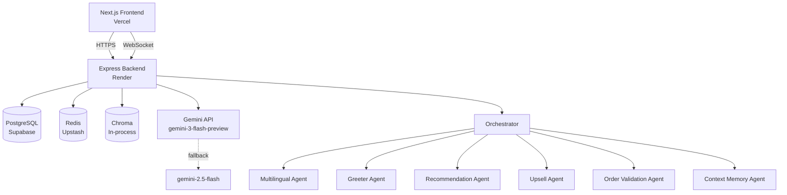

# Smart Dining Assistant

> AI-first dining experience — Zara helps you order in plain language.

## Live Demo

[Frontend](#) | [Backend Health](#) | [Loom Walkthrough](#)

## Quick Start

1. **Clone & install**
   ```bash
   cd backend && npm install
   cd ../frontend && npm install
   ```

2. **Configure env** — copy `.env.example` values into `backend/.env` and `frontend/.env.local`

3. **Database**
   ```bash
   cd backend
   npx prisma migrate dev --name init
   npm run seed
   ```

4. **Run**
   ```bash
   # Terminal 1
   cd backend && npm run dev

   # Terminal 2
   cd frontend && npm run dev
   ```

5. **Open** [http://localhost:3000/table/T1](http://localhost:3000/table/T1)

**Demo OTP:** `123456` (when `OTP_MODE=mock`)

## Architecture



## Agent Design

| Agent | Responsibility | Tools | Temp | Max Tokens |
|---|---|---|---|---|
| Multilingual NLU | Normalise Hinglish/typos → JSON intent | None | 0.2 | 150 |
| Greeter | First message, mood onboarding | None | 0.8 | 150 |
| Recommendation | RAG pipeline → 3 suggestions | `search_menu`, `get_popular_items` | 0.7 | 400 |
| Upsell | Contextual add-on triggers | `get_complementary`, `get_cart` | 0.7 | 200 |
| Context Memory | Persist preferences to Redis | None (direct Redis) | — | — |
| Order Validation | Pre-checkout checks | `validate_stock` | 0.2 | 200 |

## Design Decisions

- **No auth** — tables identified by URL `tableId`; sessions created on first visit
- **Redis cart** — runtime cart in Redis; orders persisted to PostgreSQL on checkout
- **Chroma in-process** — embeddings re-indexed on backend startup from menu DB
- **In-memory Redis fallback** — local dev works without Upstash credentials

## Trade-offs & What's Next

**Cut for demo scope:**
- Real Twilio OTP → mock with `123456` (swap `OTP_MODE=twilio` for production)
- Kitchen dashboard → would be a WebSocket room `kitchen:{restaurantId}` with order status updates
- Full group conflict resolution → last-write-wins on cart; production would need OT or CRDT
- pgvector → Chroma in-process is sufficient for demo; swap for pgvector for production scale

**Would add with more time:**
- Sentiment Agent — detect frustration → escalate with gentler rephrasing
- Cross-session preference memory — return visitor gets pre-filled preferences
- Analytics dashboard — upsell conversion rate, popular items heatmap by hour
- Image generation — AI-generated dish images from description

## Golden-Path Prompt Examples

1. **Greet:** `__INIT__` → Zara welcomes with mood chips
2. **Hinglish recommend:** `kuch spicy aur light chahiye` → 3 spicy-light dishes
3. **Add & upsell:** `add butter chicken` → item added + complementary suggestion

## LLM Fallback

Primary: `gemini-3-flash-preview` → Fallback: `gemini-2.5-flash` on 429/500/timeout/empty response. Every agent call uses `callWithFallback()`.

## Deployment

**Backend (Render):** `npm install && npx prisma generate && npx prisma migrate deploy` → `npx ts-node src/server.ts`

**Frontend (Vercel):** Root `frontend/`, set `NEXT_PUBLIC_BACKEND_URL`, `NEXT_PUBLIC_SOCKET_URL`, `NEXT_PUBLIC_APP_URL`
